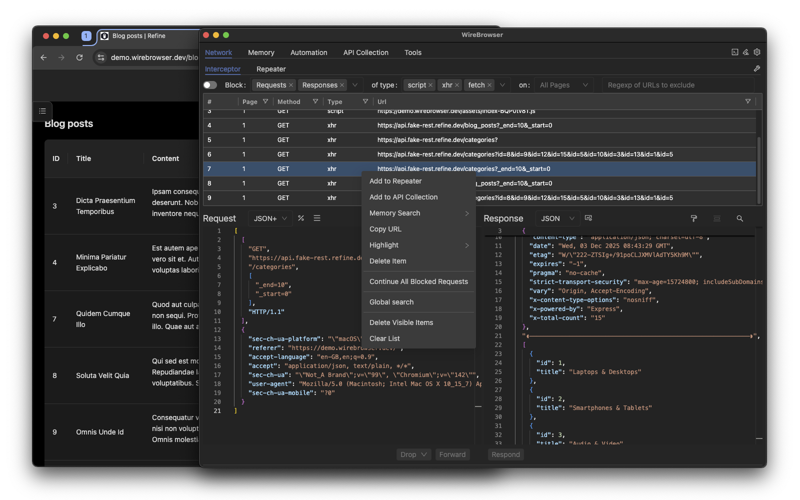
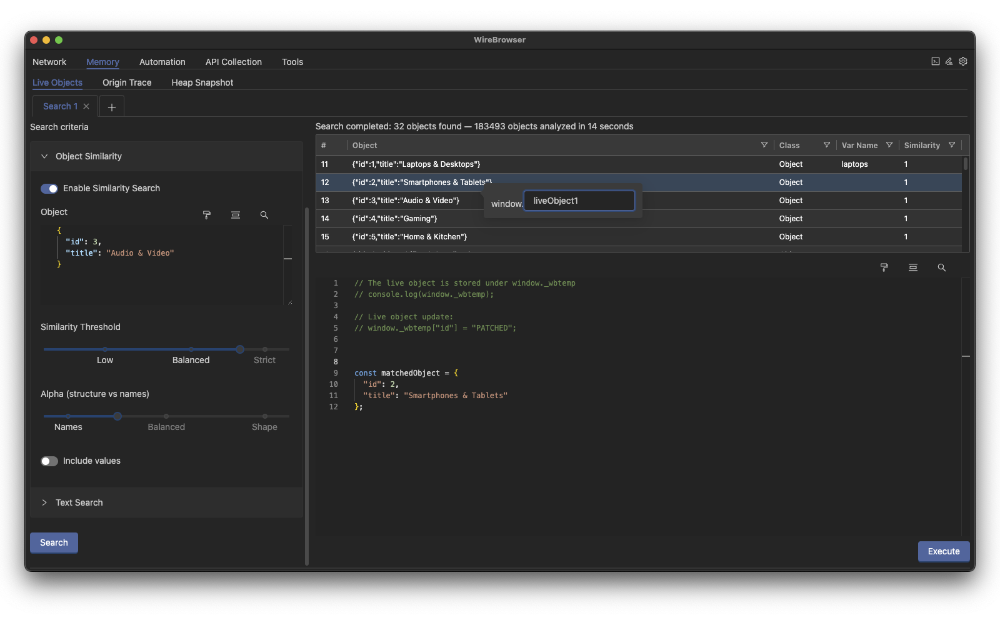
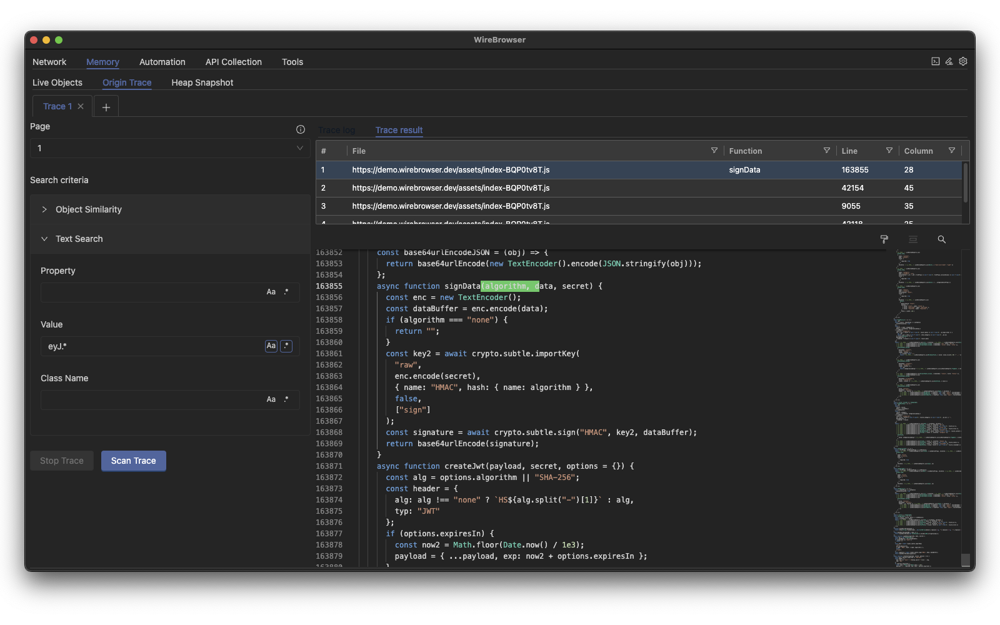

# Wirebrowser


**Wirebrowser** is a debugging, interception, and memory-inspection toolkit powered by the Chrome DevTools Protocol (CDP). It unifies **network manipulation**, API testing, automation scripting, and **deep JavaScript memory inspection** into one interface.  
With features like **Breakpoint-Driven Heap Search** and real-time **Live Object Search**, Wirebrowser provides researchers and engineers with precise, high-visibility tools for client-side analysis, reverse engineering, and complex application debugging.


## 🧭 Overview

### Network
Intercept, block, rewrite, and replay HTTP requests and responses in real time.

### Memory
Inspect, search, and modify JavaScript memory through both heap snapshots and live analysis.

 - **Live Object Search** — Search all live JavaScript objects using regex or structural matching, and patch matched objects at runtime to alter state or behavior dynamically.

- **Origin Trace (BDHS)** — Performs **automatic debugger pauses** and captures a full heap snapshot at each stop. Every **snapshot is searched** for the target value or object to identify the line of user-land code where it was created or modified.  
Framework and vendor scripts are filtered out via heuristics.

### API Collection
Create, edit, and execute API requests with variable substitution and structured collections, integrating Postman-style workflows directly into the debugging environment.


## Technical Writeup (BDHS / Origin Trace)
A full technical deep-dive is available here:
👉 https://github.com/fcavallarin/wirebrowser/blob/main/docs/BDHS-Origin-Trace.md


## 🌟 Feature Highlights

Below is a quick visual tour of Wirebrowser’s most distinctive capabilities.

### ▶️ Origin Trace (BDHS) & Live Object Search — demonstration
**[Watch the demo on YouTube](https://www.youtube.com/watch?v=WA5nHk-6UJc)**

A short walkthrough of Wirebrowser’s advanced memory-analysis capabilities:
- **Live Object Search** — real-time search and runtime patching of live JS objects.
- **Origin Trace (BDHS)** — identify the exact code location where an object is created or mutated during debugging.

---

### **Network Interceptor**
Intercept, rewrite, block, and replay HTTP requests and responses.



---

### **Memory — Live Object Search**
Search and **patch** live JS objects using regex or structural matching.



---

### **Memory — Origin Trace (BDHS)**
Capture snapshots on each debugger pause to locate the exact line responsible for object creation or mutation.




## Getting Started
### Install

```bash
git clone https://github.com/fcavallarin/wirebrowser.git
cd wirebrowser
npm install
npm run build
```

### Run
```bash
npm run wirebrowser
```

### 🐧 Linux - Sandbox issue with Electron
On some Linux distributions, Electron may fail to start due to process sandboxing restrictions, showing errors such as:

```
The SUID sandbox helper binary was found, but is not configured correctly.
```

This is a known issue in Electron ([https://github.com/electron/electron/issues/42510]).  
The most common solution is to disable AppArmor restrictions:

```
sudo sysctl -w kernel.apparmor_restrict_unprivileged_userns=0
```


## ⚙️ Additional Capabilities

Beyond the core Network and Memory workflows, Wirebrowser offers several supporting modules that enhance debugging, testing, and automation workflows.

### **API Collection**
Create, edit, and execute API requests with variable substitution and organized collections.  
Useful for testing endpoints, iterating on backend logic, or interacting with APIs directly from the same environment used for debugging the client.

### **Automation**
Run browser-side or Node.js scripts, either manually or triggered by events such as page load.  
Automation scripts have access to an `Utils` object that exposes helpers for interacting with the browser, pages, variables, iterators, and HTTP utilities.

```js
const userId = Utils.getVar("userId");
const page = Utils.getPage(1);
page.on("request", req => req.continue());
await page.goto(`https://example.com/${userId}`);
```


### Tools

A collection of small tools frequently needed during debugging and analysis, including:

- Encode or decode strings in multiple formats:  
- Create, verify, and decode **JSON Web Tokens (JWTs)**.  


## ▶️ Scope of actions — Global vs Tab-specific

Most Wirebrowser actions can be performed **either globally (across all open tabs/pages)** or **targeted to a single tab**. This lets you choose whether a rule or inspection should affect the whole browser session or only a specific page.  
Every tab/page opened by Wirebrowser has a unique integer `tabId`. Use this `tabId` to scope actions.


**UI Notes**
- Many panels offer a **scope selector** (Global / Specific Tab ID) for quick changes.


## 🛠 Tech Stack

- **Frontend (UI):** [React](https://react.dev/)  
- **Backend:** [Node.js](https://nodejs.org/)  
- **Language:** Plain **JavaScript** (no TypeScript)  

Wirebrowser is built with React and Node.js, using **plain JavaScript** to keep the codebase lightweight and hackable.  
TypeScript or JSDoc-based typing may be introduced in the future for enhanced maintainability.


## 🛣️ Roadmap

The following areas are being explored for future development:

### 🔎 Security & Crawling
- **SPA crawling** — automated crawling of single-page applications to map navigation flows and surface client-side behaviors.
- **DOM XSS scanning** — analysis of potential DOM-based XSS injection points during crawls or on-demand checks.


## 🤝 Community & Support

Wirebrowser is being built in the open — contributions and feedback are welcome!

- 💬 Chat coming soon (Discord or Matrix)
- 🐦 Follow updates on X/Twitter: https://x.com/wirebrowser
- 🧠 Issues & Ideas: https://github.com/fcavallarin/wirebrowser/issues


## 🤝 Contributing

Contributions and pull requests are welcome!  
Open an issue or pull request — even small suggestions help improve Wirebrowser.


## 📜 License

Wirebrowser™ is distributed under the **MIT License**.  
See the [LICENSE](LICENSE) file for more details.
