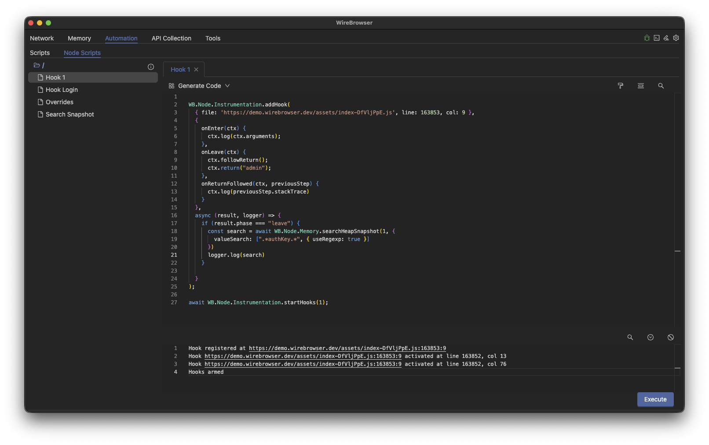
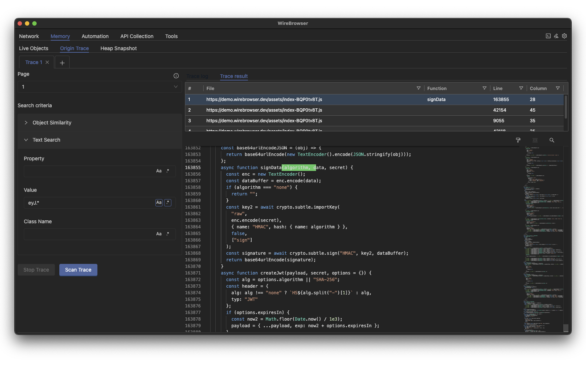
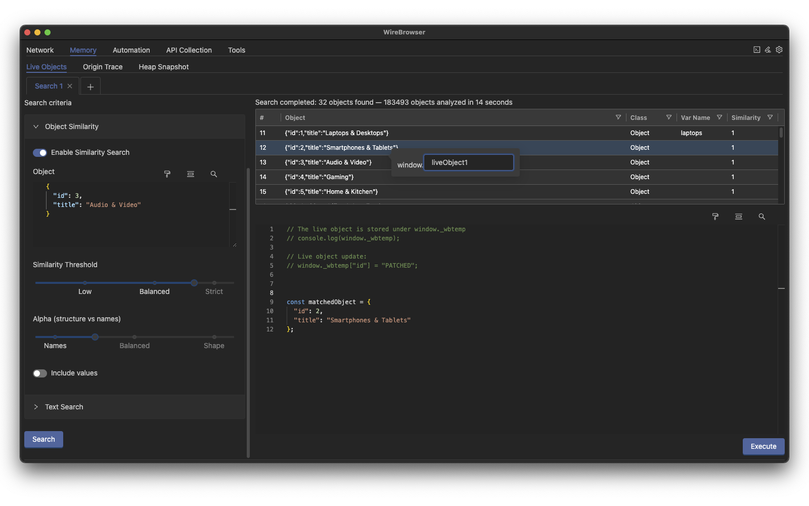
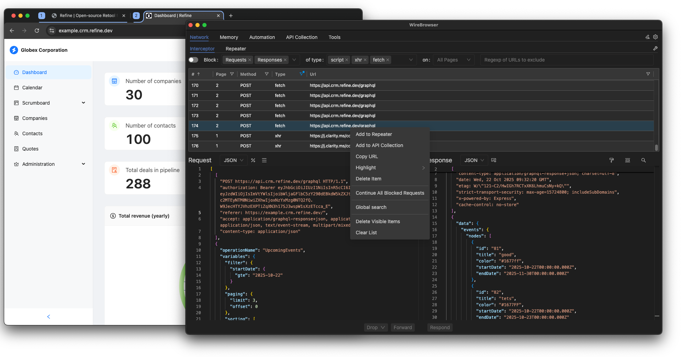

# Wirebrowser


**Wirebrowser** is a **runtime instrumentation platform for the browser**, built on top of the Chrome DevTools Protocol (CDP).

Think **Frida, but for JavaScript running in Chrome** —  
**no monkeypatching, no source rewriting, just debugger-level control.**

Wirebrowser lets you **observe, intercept, and modify execution at runtime**, even inside closures and non-global scopes that are normally unreachable.

It is designed for:
- reverse engineers
- security researchers / bug hunters
- advanced frontend developers

Core capabilities include:
- **Hooks** — inject logic and override behavior at runtime
- **Origin Trace (BDHS)** — automatically trace where a value is created or mutated
- **Live Object Search** — find and patch runtime objects
- **Network interception & replay** — modify inputs and observe effects

Unlike traditional tools, Wirebrowser focuses on **causality and execution flow**, not just inspection.

## 🔗 Quick Links

- 📘 API Documentation → https://fcavallarin.github.io/wirebrowser/api/
- ⚙️ CDP as a Runtime Instrumentation Engine Writeup → https://fcavallarin.github.io/wirebrowser/CDP-as-a-Runtime-Instrumentation-Engine
- 🧠 BDHS / Origin Trace Writeup → https://fcavallarin.github.io/wirebrowser/BDHS-Origin-Trace
- ▶️ BDHS YouTube Demo → https://www.youtube.com/watch?v=WA5nHk-6UJc


## 🧭 Overview

Wirebrowser is built around one core idea:

> **Move from inspection → to runtime control**

---

### ⚡ Runtime Instrumentation

Hook functions at runtime using CDP breakpoints — without modifying source code.

- Inject logic during execution
- Override return values
- Observe arguments and behavior
- Instrument code inside closures (not reachable from `window`)

> No monkeypatching. No fragile overrides.

---

### 🧠 Memory & Causality Analysis

Understand not just *what exists*, but **where it comes from**.

- **Origin Trace (BDHS)** — identify the exact function responsible for creating or mutating a value ([writeup](https://fcavallarin.github.io/wirebrowser/BDHS-Origin-Trace))
- **Live Object Search** — find and patch runtime objects
- **Heap Snapshot Search** — search full V8 memory (including unreachable values)

This bridges the **causality gap** in traditional debugging.

---

### 🌐 Network → Runtime Bridge

Intercept and modify inputs, then observe their effects in runtime:

- Rewrite HTTP responses
- Replay requests
- Correlate network data with runtime objects


---

## 🧠 Key Idea

Traditional tools answer:

> “What is happening?”

Wirebrowser answers:

> **“Where did this come from, and how can I change it?”**


## 🌟 Feature Highlights

Below is a quick visual tour of Wirebrowser’s most distinctive capabilities.


A short walkthrough of Wirebrowser’s advanced memory-analysis capabilities:
- **Live Object Search** — real-time search and runtime patching of live JS objects.
- **Origin Trace (BDHS)** — identify the user-land function responsible for creating or mutating the object during debugging.
- **Live Hooks** — hook the target function at runtime and override its return value or inject code.

---

### **Hooks -  Runtime Instrumentation**
Hook functions at runtime using CDP breakpoints — without modifying source code.

- Inject custom logic during execution
- Override return values
- Inspect arguments and behavior
- Works even inside closures (not reachable from `window`)



---

### **Memory — Origin Trace (BDHS)**
Automatically identify the function responsible for creating or mutating a value.

- Snapshot taken at each debugger pause
- Each snapshot is searched
- Framework/vendor code filtered via heuristics
- Includes tolerance window for contextual analysis



---

### **Memory — Live Object Search**
Search and **patch** live JS objects using regex or structural matching.




---

### **Network Interceptor**
Intercept, rewrite, block, and replay HTTP requests and responses.




## Getting Started
### 🚀 Desktop Builds (Recommended)
Pre-built desktop applications are available for:

- macOS (.dmg)
- Windows (.exe)
- Linux (.AppImage)

You can download the latest builds from the GitHub Releases page:  

👉 [https://github.com/fcavallarin/wirebrowser/releases](https://github.com/fcavallarin/wirebrowser/releases)  


### 🛠 Build from Source
If you prefer to run Wirebrowser from source:

```bash
git clone https://github.com/fcavallarin/wirebrowser.git
cd wirebrowser
npm install
npm run build
```

### Run
```bash
npm run wirebrowser
```

### 🐧 Linux Notes 

#### Sandbox issue with Electron
On some Linux distributions, Electron may fail to start due to process sandboxing restrictions, showing errors such as:

```
The SUID sandbox helper binary was found, but is not configured correctly.
```

This is a known issue in Electron ([https://github.com/electron/electron/issues/42510]).  
The most common solution is to disable AppArmor restrictions:

```
sudo sysctl -w kernel.apparmor_restrict_unprivileged_userns=0
```

#### Chrome extension location
When running Wirebrowser on Linux via the AppImage, Chromium security policies require unpacked extensions to be stored in a visible (non-hidden) directory.

For this reason, the Wirebrowser Chrome extension is installed in: 

`~/wirebrowser/chrome-extension`  

This behavior is intentional and required for Chromium to load the extension correctly.

⚠️ Do not move, rename, or hide this directory, otherwise the extension will fail to load.

## ▶️ Scope of actions — Global vs Tab-specific

Most Wirebrowser actions can be performed **either globally (across all open tabs/pages)** or **targeted to a single tab**. This lets you choose whether a rule or inspection should affect the whole browser session or only a specific page.  
Every tab/page opened by Wirebrowser has a unique integer `tabId`. Use this `tabId` to scope actions.


**UI Notes**
- Many panels offer a **scope selector** (Global / Specific Tab ID) for quick changes.


## 🤝 Contributing

Contributions and pull requests are welcome!  
Open an issue or pull request — even small suggestions help improve Wirebrowser.


## 📜 License

Wirebrowser™ is distributed under the **MIT License**.  
See the [LICENSE](LICENSE) file for more details.
